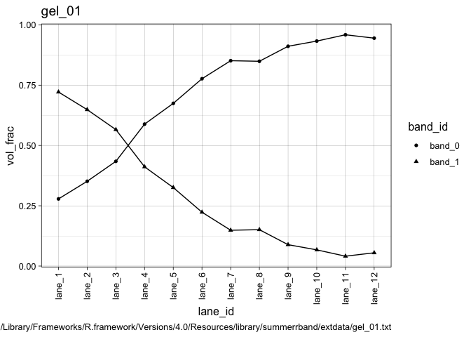
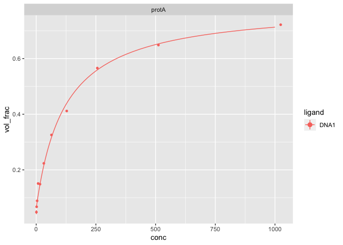

<!-- README.md is generated from README.Rmd. Please edit that file -->

# summerrband

<!-- badges: start -->

[](https://zenodo.org/badge/latestdoi/371598132)
<!-- badges: end -->

`summerrband` plays for you gel-shift data from “tapes” recorded on
Cytiva’s ImageQuant TL. Wherever the data comes from, once it’s in a
table (`data.frame`), this package gives you also a handle on fitting
dissociation constants in various ways.

## Installation

Since this package is not part of [CRAN](https://CRAN.R-project.org),
you must install and update the development version from
[GitHub](https://github.com/) with:

``` r
# install.packages("devtools")
devtools::install_github("benjbuch/summerrband")
```

## Showcases

``` r
library(summerrband)
#> Loading required package: summerr
#> 
#> Verbose logging: `options(summerr.log = TRUE)`
#> 
#> Attaching package: ‘summerr’
#> The following object is masked from ‘package:base’:
#> 
#>     normalizePath
```

### A Song on Import-Me

This is how a raw IQTL file looks like (truncated):

    #>         V1         V2          V3            V4      V5    V6      V7
    #> 1:  Lane 1                                                     Lane 2
    #> 2: Band No     Volume   Vol+BkGnd Calib Vol(ug) MW (kd)    Rf Band No
    #> 3:       1 1836717.76 10316698.58             -       - 0.318       1
    #> 4:       2  708701.15 11036571.63             -       - 0.711       2
    #>            V8          V9           V10     V11   V12     V13        V14
    #> 1:                                                     Lane 3           
    #> 2:     Volume   Vol+BkGnd Calib Vol(ug) MW (kd)    Rf Band No     Volume
    #> 3: 1952433.94 10790313.74             -       - 0.305       1 1579557.00
    #> 4: 1058242.09 13741043.81             -       - 0.688       2 1212406.97

This is how the same file will look like after tidy importing. As an
extra benefit of calling `iqtl_view` instead of `iqtl_read`, we’ll play
a preview alongside:

``` r
iqtl_view(my_file)
```



    #>     lane_id band_id       vol   vol_frac  vol+bkg CAL MW    Rf
    #>  1:  lane_1  band_0  708701.2 0.27842221 11036572  NA NA 0.711
    #>  2:  lane_1  band_1 1836717.8 0.72157779 10316699  NA NA 0.318
    #>  3:  lane_2  band_0 1058242.1 0.35149650 13741044  NA NA 0.688
    #>  4:  lane_2  band_1 1952433.9 0.64850350 10790314  NA NA 0.305
    #>  5:  lane_3  band_0 1212407.0 0.43424879 12996290  NA NA 0.685
    #>  6:  lane_3  band_1 1579557.0 0.56575121  9462001  NA NA 0.282
    #>  7:  lane_4  band_0 1836166.1 0.58849169 17137079  NA NA 0.672
    #>  8:  lane_4  band_1 1283956.3 0.41150831  8149479  NA NA 0.266
    #>  9:  lane_5  band_0 1790299.8 0.67452721 15580045  NA NA 0.646
    #> 10:  lane_5  band_1  863855.2 0.32547279  7848150  NA NA 0.273
    #> 11:  lane_6  band_0 2555067.5 0.77664741 14939456  NA NA 0.649
    #> 12:  lane_6  band_1  734800.5 0.22335259  7719780  NA NA 0.299
    #> 13:  lane_7  band_0 2921065.4 0.85142851 15641146  NA NA 0.630
    #> 14:  lane_7  band_1  509716.4 0.14857149  7455754  NA NA 0.289
    #> 15:  lane_8  band_0 2971834.7 0.84904462 15490070  NA NA 0.627
    #> 16:  lane_8  band_1  528375.6 0.15095538  6659347  NA NA 0.305
    #> 17:  lane_9  band_0 3165996.8 0.91124556 16399084  NA NA 0.614
    #> 18:  lane_9  band_1  308365.0 0.08875444  7112698  NA NA 0.269
    #> 19: lane_10  band_0 3193473.6 0.93275097 15649350  NA NA 0.633
    #> 20: lane_10  band_1  230241.5 0.06724903  7311010  NA NA 0.273
    #> 21: lane_11  band_0 3199637.7 0.95902255 15825951  NA NA 0.627
    #> 22: lane_11  band_1  136715.2 0.04097745  7497813  NA NA 0.263
    #> 23: lane_12  band_0 3382234.8 0.94492546 16349369  NA NA 0.656
    #> 24: lane_12  band_1  197132.0 0.05507454  8754550  NA NA 0.292
    #>     lane_id band_id       vol   vol_frac  vol+bkg CAL MW    Rf
    #>                                                                                              file
    #>  1: /Library/Frameworks/R.framework/Versions/4.0/Resources/library/summerrband/extdata/gel_01.txt
    #>  2: /Library/Frameworks/R.framework/Versions/4.0/Resources/library/summerrband/extdata/gel_01.txt
    #>  3: /Library/Frameworks/R.framework/Versions/4.0/Resources/library/summerrband/extdata/gel_01.txt
    #>  4: /Library/Frameworks/R.framework/Versions/4.0/Resources/library/summerrband/extdata/gel_01.txt
    #>  5: /Library/Frameworks/R.framework/Versions/4.0/Resources/library/summerrband/extdata/gel_01.txt
    #>  6: /Library/Frameworks/R.framework/Versions/4.0/Resources/library/summerrband/extdata/gel_01.txt
    #>  7: /Library/Frameworks/R.framework/Versions/4.0/Resources/library/summerrband/extdata/gel_01.txt
    #>  8: /Library/Frameworks/R.framework/Versions/4.0/Resources/library/summerrband/extdata/gel_01.txt
    #>  9: /Library/Frameworks/R.framework/Versions/4.0/Resources/library/summerrband/extdata/gel_01.txt
    #> 10: /Library/Frameworks/R.framework/Versions/4.0/Resources/library/summerrband/extdata/gel_01.txt
    #> 11: /Library/Frameworks/R.framework/Versions/4.0/Resources/library/summerrband/extdata/gel_01.txt
    #> 12: /Library/Frameworks/R.framework/Versions/4.0/Resources/library/summerrband/extdata/gel_01.txt
    #> 13: /Library/Frameworks/R.framework/Versions/4.0/Resources/library/summerrband/extdata/gel_01.txt
    #> 14: /Library/Frameworks/R.framework/Versions/4.0/Resources/library/summerrband/extdata/gel_01.txt
    #> 15: /Library/Frameworks/R.framework/Versions/4.0/Resources/library/summerrband/extdata/gel_01.txt
    #> 16: /Library/Frameworks/R.framework/Versions/4.0/Resources/library/summerrband/extdata/gel_01.txt
    #> 17: /Library/Frameworks/R.framework/Versions/4.0/Resources/library/summerrband/extdata/gel_01.txt
    #> 18: /Library/Frameworks/R.framework/Versions/4.0/Resources/library/summerrband/extdata/gel_01.txt
    #> 19: /Library/Frameworks/R.framework/Versions/4.0/Resources/library/summerrband/extdata/gel_01.txt
    #> 20: /Library/Frameworks/R.framework/Versions/4.0/Resources/library/summerrband/extdata/gel_01.txt
    #> 21: /Library/Frameworks/R.framework/Versions/4.0/Resources/library/summerrband/extdata/gel_01.txt
    #> 22: /Library/Frameworks/R.framework/Versions/4.0/Resources/library/summerrband/extdata/gel_01.txt
    #> 23: /Library/Frameworks/R.framework/Versions/4.0/Resources/library/summerrband/extdata/gel_01.txt
    #> 24: /Library/Frameworks/R.framework/Versions/4.0/Resources/library/summerrband/extdata/gel_01.txt
    #>                                                                                              file
    #>     gel_id
    #>  1: gel_01
    #>  2: gel_01
    #>  3: gel_01
    #>  4: gel_01
    #>  5: gel_01
    #>  6: gel_01
    #>  7: gel_01
    #>  8: gel_01
    #>  9: gel_01
    #> 10: gel_01
    #> 11: gel_01
    #> 12: gel_01
    #> 13: gel_01
    #> 14: gel_01
    #> 15: gel_01
    #> 16: gel_01
    #> 17: gel_01
    #> 18: gel_01
    #> 19: gel_01
    #> 20: gel_01
    #> 21: gel_01
    #> 22: gel_01
    #> 23: gel_01
    #> 24: gel_01
    #>     gel_id

Let’s assign some metadata along with the tunes:

``` r
my_data <- iqtl_meta(my_file, meta_data = list(conc = c(2^seq(10, 0), 1),
                                               protein = "protA",
                                               ligand  = "DNA1"))

head(my_data)
#>    lane_id band_id       vol  vol_frac  vol+bkg CAL MW    Rf
#> 1:  lane_1  band_0  708701.2 0.2784222 11036572  NA NA 0.711
#> 2:  lane_1  band_1 1836717.8 0.7215778 10316699  NA NA 0.318
#> 3:  lane_2  band_0 1058242.1 0.3514965 13741044  NA NA 0.688
#> 4:  lane_2  band_1 1952433.9 0.6485035 10790314  NA NA 0.305
#> 5:  lane_3  band_0 1212407.0 0.4342488 12996290  NA NA 0.685
#> 6:  lane_3  band_1 1579557.0 0.5657512  9462001  NA NA 0.282
#>                                                                                             file
#> 1: /Library/Frameworks/R.framework/Versions/4.0/Resources/library/summerrband/extdata/gel_01.txt
#> 2: /Library/Frameworks/R.framework/Versions/4.0/Resources/library/summerrband/extdata/gel_01.txt
#> 3: /Library/Frameworks/R.framework/Versions/4.0/Resources/library/summerrband/extdata/gel_01.txt
#> 4: /Library/Frameworks/R.framework/Versions/4.0/Resources/library/summerrband/extdata/gel_01.txt
#> 5: /Library/Frameworks/R.framework/Versions/4.0/Resources/library/summerrband/extdata/gel_01.txt
#> 6: /Library/Frameworks/R.framework/Versions/4.0/Resources/library/summerrband/extdata/gel_01.txt
#>    gel_id conc protein ligand
#> 1: gel_01 1024   protA   DNA1
#> 2: gel_01 1024   protA   DNA1
#> 3: gel_01  512   protA   DNA1
#> 4: gel_01  512   protA   DNA1
#> 5: gel_01  256   protA   DNA1
#> 6: gel_01  256   protA   DNA1
```

Of course, there is a batch function (`iqtl_import_all`) too.

### Fitting the Tune and Tuning the Fit

Four lines to sing:

``` r
library(magrittr)  # for the pipe operator

my_data %>% 
  dplyr::filter(band_id == "band_1") %>% 
  dplyr::group_by(protein, ligand) %>% 
  model_cleanly_groupwise(fit_Kd, formula = vol_frac ~ conc, 
                          newdata = data.frame(conc = 10^seq(0, 3, length.out = 100))) %>% 
  model_display(color = ligand) + ggplot2::facet_wrap(ggplot2::vars(protein))
```



``` r
my_data %>% 
  dplyr::filter(band_id == "band_1") %>% 
  dplyr::group_by(protein, ligand) %>% 
  model_cleanly_groupwise(fit_Kd, formula = vol_frac ~ conc) %>% 
  dplyr::select(tidy) %>% tidyr::unnest(tidy)
#> Adding missing grouping variables: `protein`, `ligand`
#> # A tibble: 3 × 7
#> # Groups:   protein, ligand [1]
#>   protein ligand term  estimate std.error statistic  p.value
#>   <chr>   <chr>  <chr>    <dbl>     <dbl>     <dbl>    <dbl>
#> 1 protA   DNA1   lower   0.0614   0.00983      6.25 1.50e- 4
#> 2 protA   DNA1   upper   0.790    0.0244      32.3  1.27e-10
#> 3 protA   DNA1   K_d   119.      14.4          8.25 1.73e- 5
```

We can also employ a model that doesn’t assume excess of the
non-titrated species R. So, when we provide its intial (total)
concentration `R0` before the equilibrium is reached:

``` r
my_data %>% 
  dplyr::filter(band_id == "band_1") %>% 
  dplyr::group_by(protein, ligand) %>% 
  model_cleanly_groupwise(fit_Kd, formula = vol_frac ~ conc, R0 = 2.0) %>% 
  dplyr::select(tidy) %>% tidyr::unnest(tidy)
#> Adding missing grouping variables: `protein`, `ligand`
#> # A tibble: 3 × 7
#> # Groups:   protein, ligand [1]
#>   protein ligand term  estimate std.error statistic  p.value
#>   <chr>   <chr>  <chr>    <dbl>     <dbl>     <dbl>    <dbl>
#> 1 protA   DNA1   lower   0.0617   0.00985      6.26 1.48e- 4
#> 2 protA   DNA1   upper   0.789    0.0245      32.2  1.33e-10
#> 3 protA   DNA1   K_d   118.      14.4          8.15 1.91e- 5
```

It is further possible to include a Hill slope if need be and to switch
between differen fitting algorithms in R.
